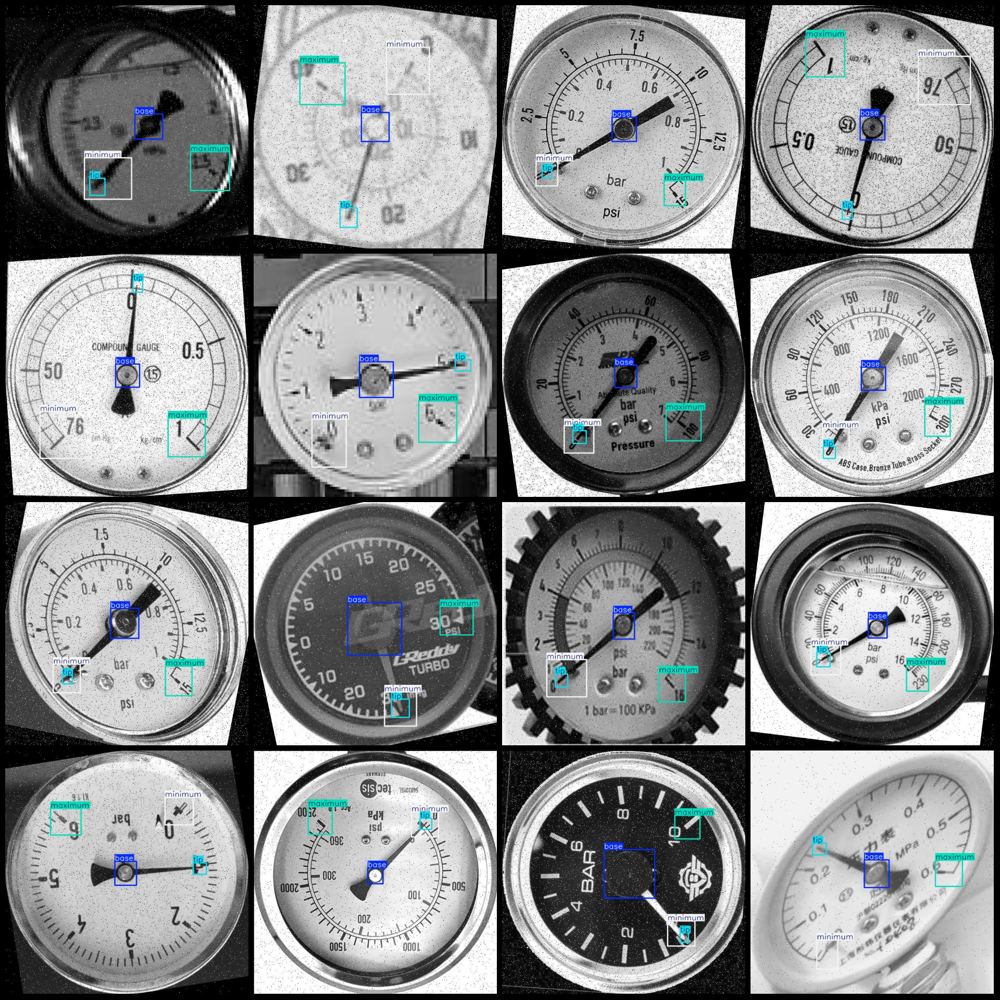

# Industrial Instrument Panel Pointer Position Detection Dataset VOC+YOLO Format - 9052 Images in 4 Categories

Dataset format: Pascal VOC format + YOLO format (txt files without split paths, only containing jpg images and corresponding VOC format xml files and yolo format txt files)

Number of images (jpg file count): 9052
Number of annotations (xml file count): 9052
Number of annotations (txt file count): 9052
Number of annotation categories: 4
Repository: firc-dataset
Annotation category names (note that the order of categories in the yolo format is not consistent with this, but according to the labels folder classes.txt): ["base","maximum","minimum","tip"]
Number of bounding boxes for each category:
Base (center position)  = 9070
Maximum (range maximum value) = 8983
Minimum (range minimum value) = 9125
Tip (pointer) = 9435
Total bounding boxes: 36613
Image resolution: 640x640
Dataset enhancement exists: Yes, there are a large number of rotationally enhanced images in the dataset, estimated to be about 1200 original images
Annotation tool used: labelImg
Annotation rules: Draw rectangles around categories
Important note: No specific statement provided
Special declaration: This dataset does not guarantee the accuracy of the trained models or weight files

Image preview:
Annotation example:

## Images

Here is a pay link on Stripe ( https://buy.stripe.com/3cs8yP7sY87d0vu9AB ). Please contact me lonlonago@foxmail.com after funding $89, and I will send you a complete data files , thank you!

